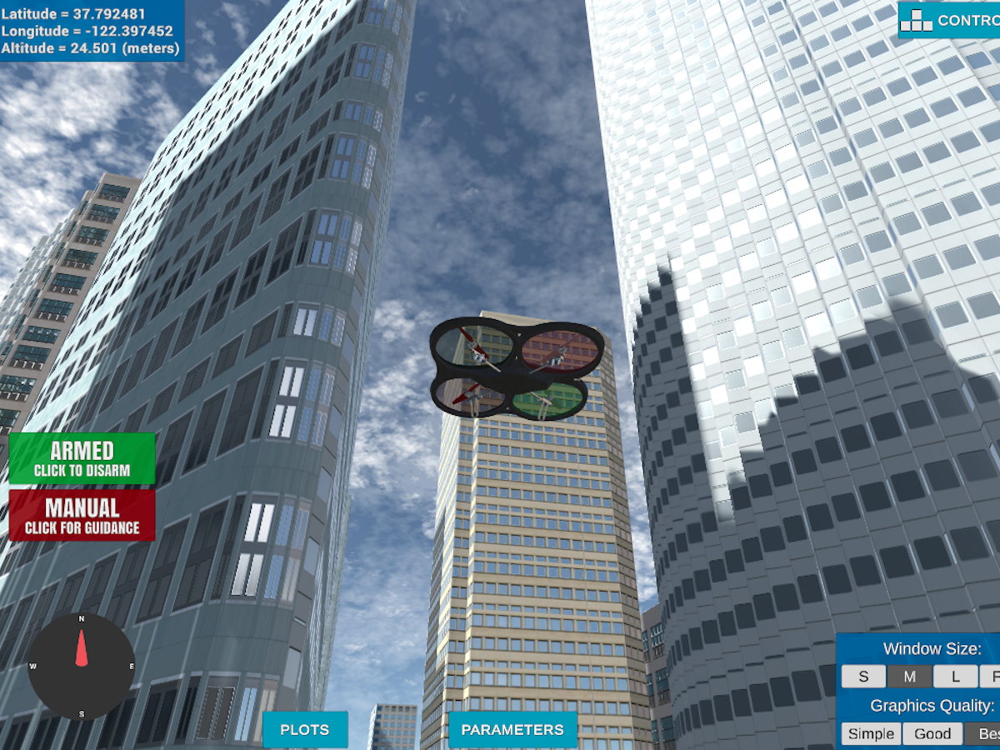

# Udacity Nanodegree - Flying Car and Autonomous Flight Engineer

## This repositiory contains my implmentation of each module in the course.

## The course was basically divided into 4 parts :
- Backyard flyer : Contains the basic flight setup and how to use the udacity's udacidrone API.

- 3D Path Planning : Path Planning for a drone to travel in complex urban environment. 

- Controls - Developing a custom controller for the quadcopter from scratch.

- Estimation - Approch to filtering and estimation methods for a quadcopter.

